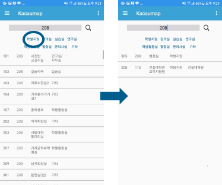
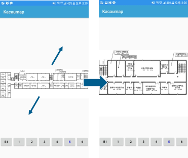
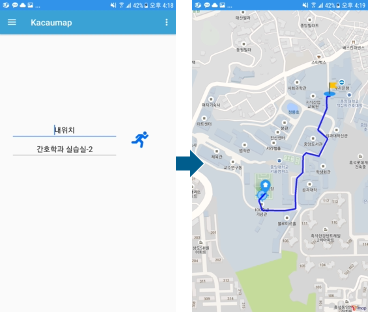

# 2017 Spring Capstone Design (50178-02)
- 과제의 제안에서 데모까지 스스로 필요한 개념을 창출하고 해결해나가는 창조적 설계능력 배양
- 3인 1조의 장기 프로젝트를 통한 협동능력 배양
- 매주 발표와 중간/최종 데모 등 상호 평가를 통해 커뮤니케이션 능력 배양

# kaCAUmap
`중앙대학교 내 장소 검색 및 길 찾기 어플리케이션`입니다.

교내 지리에 익숙하지 않은 신입생/외부인을 위해, 수많은 지원센터와 사무실의 위치를 파악해야 하는 재학생을 위해 제작했습니다.

중앙대학교 홈페이지의 캠퍼스맵과 달리 검색, 길 찾기 기능을 제공하는 어플리케이션의 형태로 사용성을 높였습니다.

주요 기능은 두 가지입니다.

1.	간단한 검색으로 교내 모든 강의실 및 편의시설의 위치 정보 제공
2.	건물 및 사용자 위치에서 목적지까지 도보 길 찾기 기능 구현

## 주요 기능
- 사용자 기능
  - 장소 검색 기능
    - 필터링
    - 내부지도
  - 길 찾기 기능
    - 내 위치에서 길 찾기
    - 특정 장소에서 길 찾기
- 관리자
  - 관리자 로그인
  - 정보 수정

## 데모 화면
</img>

< 장소검색(필터링) 스크린 화면 >

</img>

< 장소검색(내부지도) 스크린 화면 >

</img>

< 길 찾기(내 위치에서) 스크린 화면 >

## 사용법
[app-release.apk](https://github.com/SuhyeonHa/Kacaumap/tree/master/APK_manual/APK) 파일을 다운받아 실행합니다.

자세한 사용법은 [사용자매뉴얼](https://github.com/SuhyeonHa/Kacaumap/tree/master/APK_manual)을 참고해주세요.
